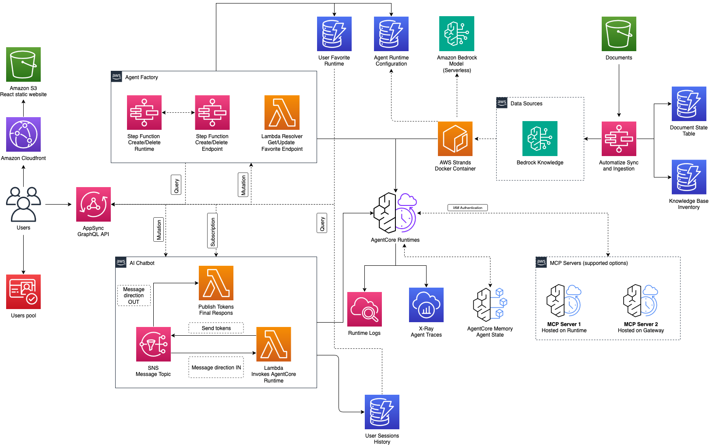

# Agentic Chatbot Accelerator

The Agentic Chatbot Accelerator is a web application deployment solution that utilizes Infrastructure as Code (CDK) to enable customers to create agentic chatbots. Built on AWS Strands and Bedrock AgentCore, this solution streamlines the development of agentic-powered chatbots.

## Architecture

- **Frontend & User Access**
  - React Static Website: Hosted on Amazon S3 and distributed globally via Amazon CloudFront for low-latency access
  - User Authentication: Managed through Amazon Cognito for secure identity and access management
  - GraphQL API: AWS AppSync serves as the primary interface for real-time backend communication
- **AI Chatbot Service** - The chatbot service orchestrates bidirectional message flow between users and AI agents:
  - User Message Flow:
    - Users send messages through an AppSync mutation and subscribe to responses via GraphQL subscriptions
    - Inbound messages are published to an Amazon SNS topic for asynchronous processing
  - Inbound Message Handler (AWS Lambda):
    - Subscribes to the SNS topic for incoming messages
    - Invokes the conversational agent hosted on Amazon Bedrock AgentCore runtime
    - Persists conversation history to Amazon DynamoDB for UI rendering and session management
    - Publishes streaming tokens and final responses to an outbound SNS topic
  - Outbound Message Handler (Lambda):
    - Subscribes to the outbound SNS topic
    - Delivers responses back to clients in real-time through AppSync GraphQL subscriptions
- **Agent Factory** - The Agent Factory provides dynamic agent lifecycle management and configuration:
  - AppSync Resolvers: Handle CRUD operations for Bedrock AgentCore runtime instances
  - Agent Configuration:
    - Amazon ECR container images package AWS Strands Agents with flexible configuration options
    - Runtime configurations are dynamically applied based on settings stored in DynamoDB
    - Supports agent runtime creation/deletion, endpoint management, and favorite endpoint persistence
    - MCP Servers: Users can attach existing Model Context Protocol (MCP) servers to their agents, enabling integration with external tools and resources
  - Agent Runtime Dependencies:
    - Foundation Models: Serverless large language models hosted on Amazon Bedrock
    - Data Sources: Amazon Bedrock Knowledge Bases enable semantic/hybrid search and retrieval-augmented generation (RAG)
  - Storage: Amazon DynamoDB for agent configuration management
- **Agent Execution Environment** - The agent execution layer handles the core AI processing and integration:
  - Runtime Deployment: Agents are deployed to Amazon Bedrock AgentCore Runtime as Docker containers registered in Amazon ECR
  - Knowledge Integration (**if enabled in CDK configuration**):
    - Agents connect to Amazon Bedrock Knowledge Bases to implement retrieval tools for RAG
    - Knowledge bases are automatically populated via an AWS Step Functions workflow triggered when documents are uploaded to a designated Amazon S3 bucket
  - Observability & Monitoring (Amazon AgentCore Observability):
    - Agent runtime logs are stored in Amazon CloudWatch Logs for debugging and analysis
    - Distributed traces are captured in AWS X-Ray for performance monitoring and troubleshooting
  - State Management: Agents persist conversational state using Amazon Bedrock AgentCore Memory (when enabled) for context-aware interactions

## UX Flow

- Check out the [AgentCore Endpoint Manager demo](./docs/gifs/runtime-setup.gif)
- Check out the [Agent Chat demo](./docs/gifs/chatbot-exp.gif)

## Dive Deeper

- [API Reference](./docs/src/api.md)
- [Expanding AI Tools](./docs/src/expanding-ai-tools.md)
- [How to Deploy](./docs/src/how-to-deploy.md)
- [Knowledge Base Management](./docs/src/kb-management.md)
- [Development Guide](./docs/src/development-guide.md)
- [Agent Factory](./docs/src/agent-factory.md)
- [Agent Event Architecture](./docs/src/token-streaming-architecture.md)
- [Observability Insights](./docs/src/observability-insights.md)
- [Terraform Deployment (Experimental)](./iac-terraform/README.md)

## Optional Features

The accelerator supports flexible deployment configurations. The **Knowledge Base** feature (document processing and RAG capabilities) is optional and can be disabled by omitting `knowledgeBaseParameters` and `dataProcessingParameters` from the configuration file. This enables lighter deployments focused only on agent management when RAG is not needed. See [How to Deploy](./docs/src/how-to-deploy.md#deployment-scenarios) for details.

## How to Get Started

1. **Install required packages**: Run `npm install`
2. **Configure features** *(optional)*: Create `bin/config.yaml` to customize deployment (see [How to Deploy](./docs/src/how-to-deploy.md))
3. **Deploy Infrastructure**: Run either `make deploy` or `make deploy-finch` to deploy the CDK stack with Docker or Finch, respectively
4. **Create User**: Add a user to the Cognito User Pool (<environment-prefix>-aca-userPool) via AWS Console
5. **Access Application**: Open the web application using the URL from CDK deployment outputs
6. **Configure Agent**: Use the Agent Factory to create and configure your first AgentCore runtime
7. **Test & Chat**: Interact with your agent through the chatbot interface
8. **Iterate**: Refine agent settings, add tools, and redeploy as needed

## How to Contribute

See [CONTRIBUTING.md](./CONTRIBUTING.md) for detailed contribution guidelines.

- **Bug Reports & Feature Requests**: Create issues in GitHub for bugs or new feature proposals
- **Security Scan**: Run ASH (Automated Security Helper) scan before opening a pull request for review
- **Major Changes**: Propose a design document before implementing significant features or architectural changes

## Security

Note: this asset represents a proof-of-value for the services included and is not intended as a production-ready solution. You must determine how the AWS Shared Responsibility applies to their specific use case and implement the needed controls to achieve their desired security outcomes. AWS offers a broad set of security tools and configurations to enable our customers.

Ultimately it is your responsibility as the developer of a full stack application to ensure all of its aspects are secure. We provide security best practices in repository documentation and provide a secure baseline but Amazon holds no responsibility for the security of applications built from this tool.

## License

This project is licensed under the MIT-0 License. See the LICENSE file.
