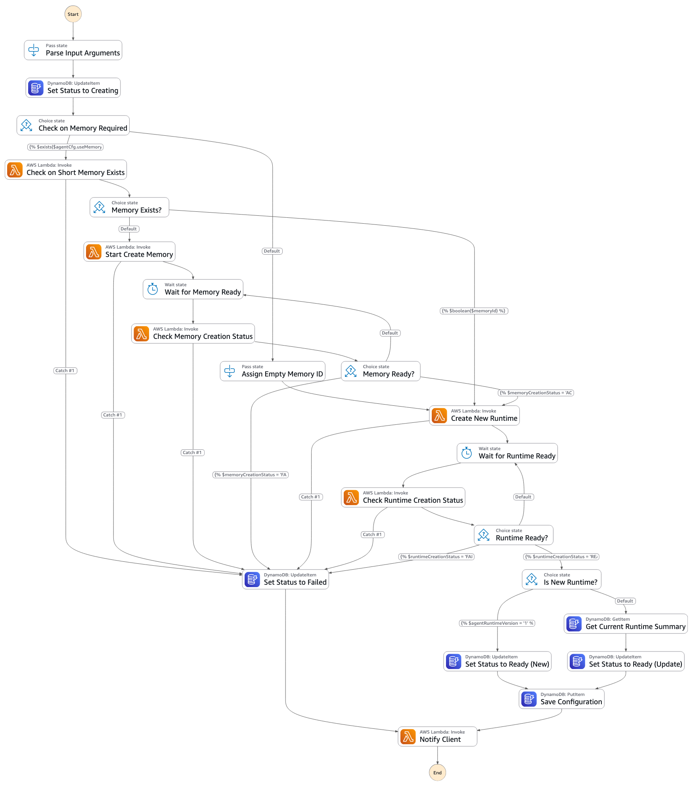
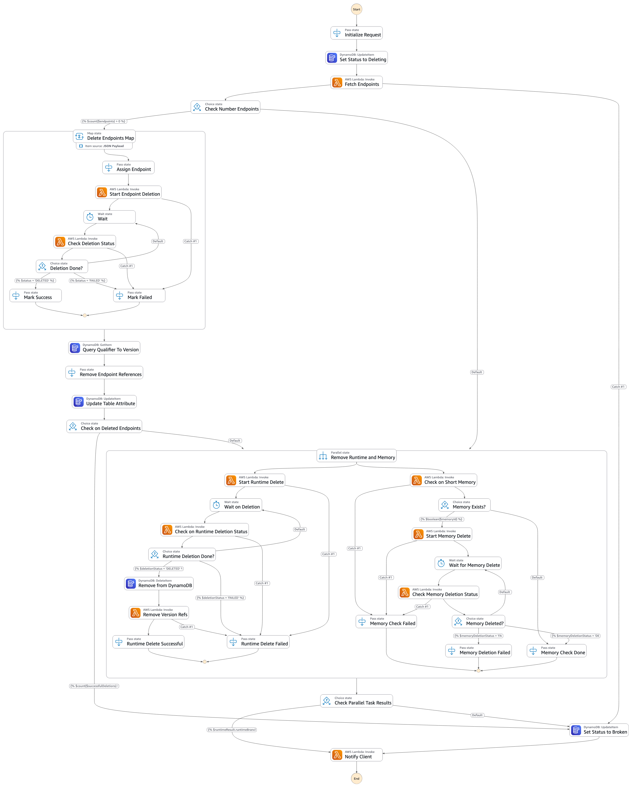
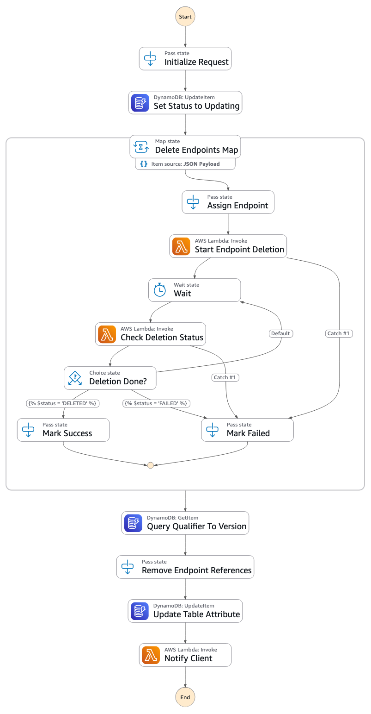

# Agent Factory Operations

This document provides a comprehensive overview of the Agent Factory operations, categorizing them by their execution model (fire-and-forget vs synchronous) and explaining their functionality.

## Overview

The Agent Factory provides a GraphQL API for managing AgentCore runtimes, including creating, configuring, tagging, and deleting agent runtimes and their endpoints. Operations are categorized into two types:

- **Fire-and-Forget (Asynchronous)**: Operations that trigger AWS Step Functions for long-running processes
- **Synchronous**: Operations that return immediate results from direct API calls or database queries

---

## Fire-and-Forget Operations (Async via Step Functions)

These operations initiate asynchronous workflows using AWS Step Functions. They return immediately after starting the execution, and the actual work is performed in the background.

### 1. createAgentCoreRuntime

**Type:** Mutation
**Execution Model:** Asynchronous (Step Function)

Creates a new AgentCore Runtime by starting a Step Function execution.

**Parameters:**
- `agentName` (string): The unique name identifier for the agent runtime
- `configValue` (string): A JSON string containing the agent configuration conforming to the AgentConfiguration schema

**Validation:**
- First validates the input is valid JSON
- Then validates against the AgentConfiguration Pydantic model

**Returns:**
- The `agentName` if Step Function execution started successfully
- Empty string if validation fails or execution could not be started

**Step Function:** `CREATE_RUNTIME_STATE_MACHINE_ARN`

**Process Flow:**

**Notes:**
- A successful return only indicates the creation process has been initiated, not that the runtime has been fully created
- The actual runtime creation happens asynchronously in the Step Function

---

### 2. deleteAgentRuntime

**Type:** Mutation
**Execution Model:** Asynchronous (Step Function)

Deletes an agent runtime by starting a Step Function execution.

**Parameters:**
- `agentName` (string): Name of the agent to delete
- `agentRuntimeId` (string): ID of the agent runtime to delete

**Returns:**
- The `agentRuntimeId` if Step Function execution started successfully
- Empty string if execution could not be started

**Step Function:** `DELETE_RUNTIME_STATE_MACHINE_ARN`

**Process Flow:**

**Notes:**
- This is a destructive operation that removes the entire agent runtime
- Deletion happens asynchronously in the Step Function

---

### 3. deleteAgentRuntimeEndpoints

**Type:** Mutation
**Execution Model:** Asynchronous (Step Function)

Deletes one or more agent runtime endpoints by starting a Step Function execution.

**Parameters:**
- `agentName` (string): Name of the agent
- `agentRuntimeId` (string): ID of the agent runtime
- `endpointNames` (list[string]): List of endpoint names to delete

**Returns:**
- The `agentRuntimeId` if Step Function execution started successfully
- Empty string if execution could not be started

**Step Function:** `DELETE_ENDPOINTS_STATE_MACHINE_ARN`

**Process Flow:**

**Notes:**
- Multiple endpoints can be deleted in a single operation
- Deletion happens asynchronously in the Step Function

---

## Synchronous Operations

These operations execute immediately and return results directly from AWS services (DynamoDB, Bedrock AgentCore API).

### 1. listRuntimeAgents

**Type:** Query
**Execution Model:** Synchronous (DynamoDB Scan)

Retrieves all agent runtime summaries from DynamoDB.

**Parameters:** None

**Returns:** List of agent runtime objects containing:
- `agentName`: Name of the agent
- `agentRuntimeId`: Runtime ID of the agent
- `numberOfVersion`: Number of versions for the agent
- `qualifierToVersion`: JSON string mapping qualifiers to versions
- `status`: Current status of the agent (e.g., "Ready")

**Data Source:** `AGENT_CORE_SUMMARY_TABLE`

**Notes:**
- Uses DynamoDB scan with pagination to retrieve all items
- Returns empty list if scan operation fails

---

### 2. getRuntimeConfigurationByVersion

**Type:** Query
**Execution Model:** Synchronous (DynamoDB Query)

Retrieves agent runtime configuration for a specific version.

**Parameters:**
- `agentName` (string): Name of the agent
- `agentVersion` (string): Version of the agent runtime

**Returns:**
- JSON configuration string for the specified agent version
- Empty string if not found or query fails

**Data Source:** `AGENT_CORE_RUNTIME_TABLE` (using `byAgentNameAndVersion` index)

---

### 3. getRuntimeConfigurationByQualifier

**Type:** Query
**Execution Model:** Synchronous (DynamoDB Query)

Retrieves agent runtime configuration using a qualifier (e.g., "prod", "dev", "DEFAULT").

**Parameters:**
- `agentName` (string): Name of the agent
- `qualifier` (string): Qualifier to map to a specific version

**Returns:**
- JSON configuration string for the agent version mapped to the qualifier
- Empty string if not found or query fails

**Process:**
1. Queries `AGENT_CORE_SUMMARY_TABLE` to get qualifier-to-version mapping
2. Queries `AGENT_CORE_RUNTIME_TABLE` with the resolved version

---

### 4. getDefaultRuntimeConfiguration

**Type:** Query
**Execution Model:** Synchronous (DynamoDB Query)

Retrieves the default runtime configuration for an agent (uses "DEFAULT" qualifier).

**Parameters:**
- `agentName` (string): Name of the agent

**Returns:**
- JSON configuration string for the default agent version
- Empty string if not found or query fails

**Notes:**
- This is a convenience method that calls `getRuntimeConfigurationByQualifier` with qualifier "DEFAULT"

---

### 5. tagAgentCoreRuntime

**Type:** Mutation
**Execution Model:** Synchronous with Polling (Bedrock AgentCore + DynamoDB)

Creates an agent runtime endpoint with a qualifier and updates version mapping.

**Parameters:**
- `agentName` (string): Name of the agent
- `agentRuntimeId` (string): ID of the agent runtime
- `currentQualifierToVersion` (string): JSON string mapping current qualifiers to versions
- `agentVersion` (string): Version of the agent runtime to tag
- `qualifier` (string): Qualifier name for the endpoint
- `description` (string, optional): Description for the endpoint

**Returns:**
- The `qualifier` name if successful
- Empty string if failed

**Process:**
1. Creates agent runtime endpoint via Bedrock AgentCore API
2. Polls endpoint status until READY (with retry mechanism - up to 58 attempts with 0.5s delay)
3. Updates `AGENT_CORE_SUMMARY_TABLE` with new qualifier-to-version mapping

**Notes:**
- This operation waits for the endpoint to be ready before returning
- Uses exponential backoff retry mechanism for endpoint creation status checks
- Tags endpoints with Stack and Environment metadata

---

### 6. listAgentVersions

**Type:** Query
**Execution Model:** Synchronous (Bedrock AgentCore API)

Lists all available versions for a specific agent runtime.

**Parameters:**
- `agentRuntimeId` (string): The unique identifier of the agent runtime

**Returns:** List of agent runtime version strings (only those with status "READY")

**API:** `BAC_CLIENT.list_agent_runtime_versions`

**Notes:**
- Implements pagination to retrieve all versions (maxResults=100 per page)
- Filters to only include versions with "READY" status

---

### 7. listAgentEndpoints

**Type:** Query
**Execution Model:** Synchronous (Bedrock AgentCore API)

Lists all endpoint names for a specific agent runtime.

**Parameters:**
- `agentRuntimeId` (string): The unique identifier of the agent runtime

**Returns:** List of endpoint names (only those with status "READY")

**API:** `BAC_CLIENT.list_agent_runtime_endpoints`

**Notes:**
- Implements pagination to retrieve all endpoints (maxResults=100 per page)
- Filters to only include endpoints with "READY" status

---

## Error Handling

All operations implement comprehensive error handling:
- **Fire-and-Forget Operations**: Log errors and return empty string if Step Function execution fails to start
- **Synchronous Operations**: Log errors with detailed context and return empty values (empty string or empty list)
- **Validation Errors**: Configuration validation errors are logged with the full error message

## Logging and Observability

All operations use AWS Lambda Powertools for:

- Structured logging with correlation IDs
- X-Ray tracing for distributed tracing
- Detailed error logging with context
