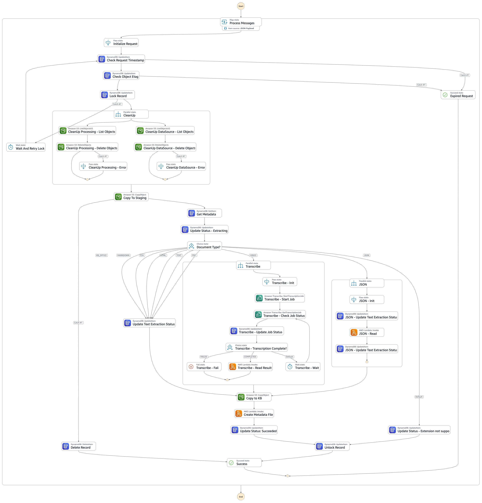
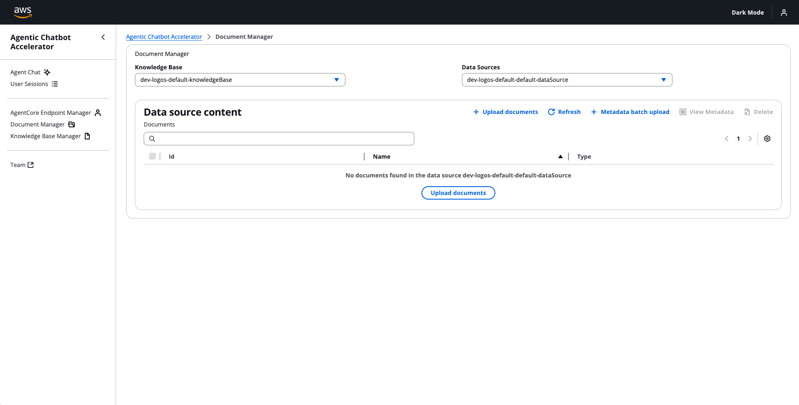
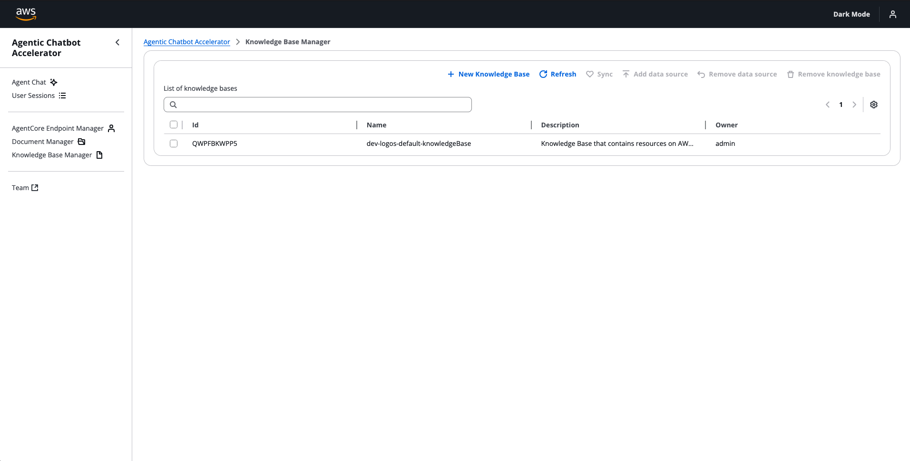

# Knowledge Base Management

> ⚠️ **Note:** The Knowledge Base feature is optional. It is only available when `knowledgeBaseParameters` and `dataProcessingParameters` are configured in `bin/config.yaml`. If these parameters are omitted, the Knowledge Base navigation items will not appear in the UI. See [How to Deploy](./how-to-deploy.md#deployment-scenarios) for more details on deployment configurations.

## Document Processing Pipeline

<figure id="fig-pipeline" style="text-align: center;">
  
  <figcaption>Document processing pipeline.</figcaption>
</figure>

This figure shows an AWS Step Functions workflow that prepares various document types for integration with Amazon Bedrock Knowledge Bases. The workflow processes:

- All [natively supported Bedrock Knowledge Base formats](https://docs.aws.amazon.com/bedrock/latest/userguide/knowledge-base-ds.html#kb-ds-supported-doc-formats-limits)
- Multimedia content (video and audio files)

The workflow follows these high-level steps:

1. **Trigger Event**
    - Initiated when files are uploaded to the _inputPrefix_ (see [configuration file](../../bin/config.ts), e.g., `inputs/`) in the Amazon S3 _data-bucket_ (handled by Amazon EventBridge)
    - Processing state is stored in the _document-state_ table (Amazon DynamoDB)
    - A unique _documentId_ is assigned to each document

2. **Concurrency Control - Locking**
    - Checks request timestamp for expiry; the latest timestamp is stored in the _document-state_ table
    - Verifies document hash (Entity Tag) to avoid unnecessary reprocessing
    - Locks the document for processing and marks it as locked in the _document-state_ table

3. **Cleanup**
    - Removes previously generated intermediate processing data for the document, stored under _processingPrefix_ (e.g., `processing`)
    - Removes previous processing results stored in _dataSourcePrefix_ (e.g., `knowledge-base-data-source`)
    - Copies the file from _inputPrefix_ to _processingPrefix_/_documentId_/_stagingMidfix_
      - If the file doesn't exist or copying fails, the document record is removed (equivalent to _DELETE DOCUMENT_)
      - If copying succeeds, new processing begins

4. **Processing Logic**
      - Handles different file types through specialized workflows:
        - **Native formats**: Direct transfer to destination (PDFs, Word documents, Excel sheets, CSV, TXT, HTML, markdown)
        - **Multimedia files**: Processing through Amazon Transcribe
        - **Formatted JSON files**: Processing JSON in this format: ```{"text": "...", "metadata": {...}}```
        - **Unsupported formats**: Graceful exit with appropriate status indicators
      - After processing, output is copied to the _dataSourcePrefix_ with metadata added in subsequent steps

5. **Metadata Management**
      - Generates required JSON metadata files for Bedrock Knowledge Base compatibility
      - Creates paired metadata files (e.g., `document.txt.metadata.json` for `document.txt`)
      - Initializes with basic `filename` attribute
      - Supports extensible metadata through custom implementations

6. **Concurrency Control - Unlocking**
      - The document is unlocked by removing the `LockedBy` flag from the _document-state_ table
      - A document is considered unlocked if it doesn't exist in the _document-state_ table or if the `LockedBy` column is missing

Processed documents are stored in the _dataSourcePrefix_ (e.g., `knowledge-base-data-source`). A Knowledge Base ingestion job is triggered automatically.

ℹ️ The agentic chatbot accelerator doesn't include advanced intelligent document processing (IDP) in its scope. We assume advanced IDP patterns should be handled as pre-processing before ingestion by leveraging solutions like [Gen AI Intelligent Document Processing](https://github.com/aws-solutions-library-samples/accelerated-intelligent-document-processing-on-aws). However, the pipeline outlined in this section remains valuable for tracking documents and metadata in knowledge bases used by agents.

## Managing Existing Knowledge Bases from the UI



Users can view, add, and delete documents that are part of an existing knowledge base from the *Document Manager* page.

As shown in the GIF, users can also manage document metadata. For example, they can upload metadata for a set of documents using a JSONL file structured like this:

```jsonl
{"documentId": "554a30e1-dc599463-aee2c614-bddf880a", "metadata": {"filename": "microservices-on-aws.pdf", "services": ["AWS Lambda"]}}
{"documentId": "0f8e0cbb-5f9786a6-62661226-0a10de28", "metadata": {"filename": "bedrock-or-sagemaker.pdf", "services": ["Amazon Bedrock", "Amazon SageMaker"]}}
{"documentId": "6691adfa-1a58a019-850e87e8-919025f6", "metadata": {"filename": "generative-ai-on-aws-how-to-choose.pdf", "services": ["Amazon Bedrock", "Amazon SageMaker"]}}
```

## Creating New Knowledge Bases



Users can create new Bedrock Knowledge Bases to attach to agents. This allows users to test different chunking and vector embedding options. Knowledge bases created by a user are only visible to that user by default. Note that the CDK will clean up Bedrock Knowledge Bases created from the application upon destruction using a [custom cleanup Lambda function](../../lib/cleanup/functions/cleanup-handler/index.py).

## Reranking Configuration

Reranking improves retrieval relevance by re-scoring documents after the initial vector search. When enabled, the system first retrieves a larger set of candidate documents using vector similarity, then applies a reranking model to reorder them based on semantic relevance to the query.

### Supported Reranking Models

The accelerator supports the following reranking models via Amazon Bedrock:

| Model | Model ID | Description |
|-------|----------|-------------|
| **Cohere Rerank 3.5** | `cohere.rerank-v3-5:0` | High-quality reranking model from Cohere with strong multilingual support |
| **Amazon Rerank 1.0** | `amazon.rerank-v1:0` | Amazon's native reranking model optimized for Bedrock |

### Cross-Region Support

Reranking models have limited regional availability. The accelerator automatically handles cross-region reranking by:

1. Checking if the reranking model is available in the current deployment region
2. If not available, automatically falling back to a supported region based on geographic proximity:
   - US regions → `us-east-1`
   - EU regions → `eu-central-1`
   - AP regions → `ap-northeast-1`

This ensures reranking functionality works regardless of where the agent is deployed.

### Enabling Reranking in Agent Factory

When configuring a knowledge base tool in the Agent Factory wizard:

1. Select a knowledge base to attach to your agent
2. Click **Configure** to open the knowledge base settings
3. Enable the **Enable Reranking** checkbox
4. Select a reranking model from the dropdown (Cohere Rerank 3.5 or Amazon Rerank 1.0)
5. Set the **Number of Results After Reranking** (default: 5) - this is the final number of documents returned after reranking

### Configuration in `bin/config.yaml`

To make reranking models available in the UI, add the `rerankingModels` configuration:

```yaml
rerankingModels:
    Cohere Rerank 3.5: "cohere.rerank-v3-5:0"
    Amazon Rerank 1.0: "amazon.rerank-v1:0"
```

See [How to Deploy](./how-to-deploy.md) for the complete configuration reference.
